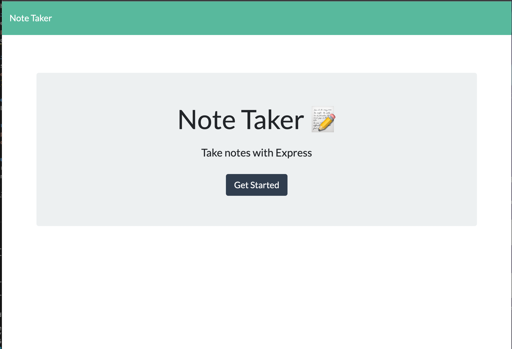
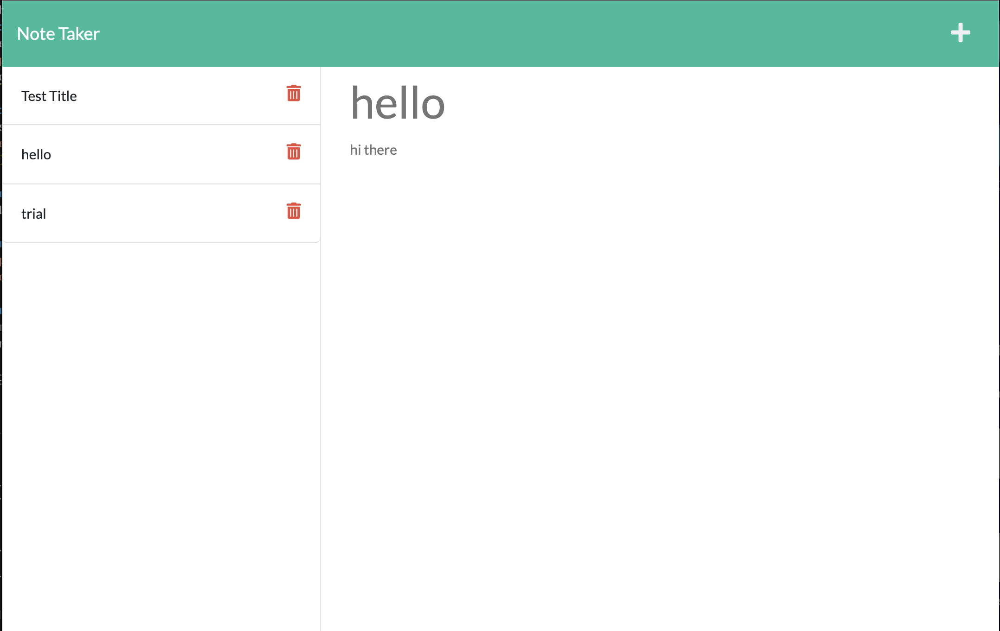

# Note_Taker_Express.js
Week 11: Express.js Note Taker

# Objectives 
To make a note taking app. This application will allow the user to write and save notes. So the user can see past notes and be able to make new notes with  a title. 
## Link to Webpage 
Here is the link to the [Note Take Webpage](https://damp-retreat-32188.herokuapp.com/)

## License 
This project is licensed unser the  [MIT License](https://opensource.org/licenses/MIT).

## Technologies Used:
HTML5, CSS, Javascript, Express.js

## Preview

# Questions
 For any further assistance, you may contact me at:
  * Github: [fiona1nicdao](<https://github.com/fiona1nicdao>)
